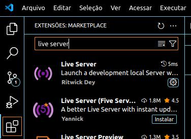
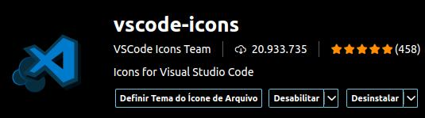
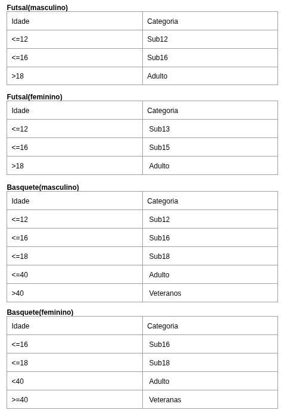

# Notas de aulas - Algoritmos - 2025/1 - TIII - UTFPR/CM

## 21/03/2025 - Sexta-feira

Apresentação da disciplina

Dinâmica: o robô segue os comandos.

Linguagem: a importância da terminologia 

Byte - Sistema computacional

## 24/03/2025 - Segunda

### Recapitulação das aulas anteriores

1. Problema
2. Algoritmo (para resolver o problema)
3. Código fonte é o algoritmo escrito em uma linguagem de programação (humanos entendem)
4. Programa (ou app) é o código fonte compilado (traduzido) para uma linguagem que o computador entende e executa.

Formalização de conceitos sobre algoritmos: entrada, processamento, saída. Características: estado inicial, limite de resolução, condição e repetição.

Exercício/Exemplo
https://github.com/rjhalmeman/algoritmos/tree/main/1bimestre/2025-03-24%20-%20Exerc%C3%ADcios

## 28/03/2025 - Sexta

Aulas em sala teórica: G101
`Estruturas sequenciais. `

Estruturação de raciocínio lógico.
    - Entrada
    - Processamento
    - Saída

Leitura de algoritmos e teste de mesa.

### Desenhe a fruta conforme a descrição abaixo

Uma fruta de formato redondo ou ligeiramente achatado. Sua casca é lisa e pode ter diferentes cores, como vermelho, verde ou amarelo. Quando você segura, ela tem uma textura firme, mas suave ao toque. Ao pressioná-la levemente, você sente que ela é um pouco dura, mas tem uma leve elasticidade.

O cheiro é doce e refrescante, e quando você a morde, sente um gosto doce ou levemente ácido, dependendo da variedade. O interior é crocante e suculento, com pequenas sementes no centro, que ficam dentro de um pequeno núcleo, geralmente de cor marrom.

Tem um peso que é fácil de segurar com uma mão, e ao mordê-la, o som da crocância é nítido. O sabor é uma mistura de frescor e doçura, com uma leve acidez que pode ser refrescante.

### Desenhe a interface gráfica (tela) conforme a descrição abaixo:

```HTML
<!DOCTYPE html>
<html lang="pt-br">
<head>
    <meta charset="UTF-8">
    <meta name="viewport" content="width=device-width, initial-scale=1.0">
    <title>Exemplo 02</title>
</head>
<body>

    <h1>Calculadora de Troco</h1>
    <label for="valorCompra">Valor da Compra: R$ </label>
    <input type="number" id="valorCompra" >
    <br><br>
    <label for="valorPago">Valor Pago: R$ </label>
    <input type="number" id="valorPago">
    <br><br>
    <input type="button" value="Calcular" onclick="calcular()">
    <br><br>
    <label for="resultado">Troco</label>
    <p id="resultado"></p>

    <script>
        function calcular() {
            let valorCompra = parseFloat(document.getElementById("valorCompra").value);
            let valorPago = parseFloat(document.getElementById("valorPago").value);

            let troco = valorPago - valorCompra;

            document.getElementById("resultado").innerHTML = troco.toFixed(2);
        }
    </script>

</body>
</html>
```

### Explique a dinâmica de funcionamento do programa (considerando a tela que você desenhou)

### Teste de mesa. Considere diversos valores de compra e valores pagos. Mostre os resultados.

<p style="text-align: center; font-weight: bold; font-family: 'Caveat', cursive; font-size: 22px; color:red">
        Teste de mesa é feito manualmente (sem executar o programa em um computador) informando valores para as entradas de dados, fazendo o processamento manualmente e apresentando os resultados.
    </p>

## 31/03/2025 - Segunda

### Leitura de algoritmos - Exercícios

### Como usar o VSCode para fazer os exercícios.

- atividade prática desenvolvida em sala de aulas

---

### Instalação do VSCode (Visual Studio Code)

Para instalar no computador pessoal

Tutorial (canal Dev Point)
https://www.youtube.com/watch?v=rNArHhYMn-s

No vídeo ele instala a extensão Code Runner. 
Instale também as extensões
Live Server.


Português Brasil


vscode-icons


Depois que instalar, clic no Menu Arquivo (File...) e ative a opção Salvamento automático (Auto save).

As listas de exercícios 2 e 4 devem ser feitas.
https://github.com/rjhalmeman/algoritmos/blob/main/1bimestre/02_listaDeExercicios_Sequenciais.md

https://github.com/rjhalmeman/algoritmos/blob/main/1bimestre/04_listaDeExercicios_Sequenciais.md

---

## 04/04/2025

Aulas em sala teórica - realização de atividade autoavaliativa.

### [Atividade autoavaliativa 01.pdf](https://github.com/rjhalmeman/algoritmos/blob/main/1bimestre/Autoavalia%C3%A7%C3%A3o%2001.pdf)

[Programas em HTML e JavaScript - Github](https://github.com/rjhalmeman/algoritmos/tree/main/1bimestre/2025-04-04%20-%20Autoavalia%C3%A7%C3%A3o)

O objetivo da atividade é possibilitar que os alunos percebam onde estão as dificuldades e possam solicitar ajuda ao professor e/ou discente de apoio.

Formalização de passos para a resolução de problemas. Estruturas sequenciais. 
Teste de mesa.


## 07/04/2025

Recapitulação (RAM e variáveis)

Concatenação de string + variável
criação de funções

Console.log()


[Lista de exercícios 03 - foco nos testes de mesa](https://github.com/rjhalmeman/algoritmos/blob/main/1bimestre/03_listaDeExercicios_Sequenciais%20-%20TesteDeMesa.md)

Variáveis. Tipos de dados. Ambiente de desenvolvimento
Exercícios com expressões aritméticas, atribuição e saída simples.

## 11/04/2025

Condicionais

Exemplo 2 - Maioridade
```html
<!DOCTYPE html>
<html lang="pt-BR">

<head>
  <meta charset="UTF-8">
  <title>Verificar Maioridade</title>
</head>
<!-- Lê a idade de uma pessoa e se for maior de idade mostra o que ela pode fazer -->
<body>

  <h2>Informe sua idade:</h2>
  
  <input type="number" id="idadeInput" placeholder="Digite sua idade">
  <input type="button" value="Verifique" onclick="verificarIdade()">
  <br><br>
  <span id="resultado"></span>

  <script>
    function verificarIdade() {
      let idade = parseInt(document.getElementById("idadeInput").value);
      let resultado = document.getElementById("resultado");

      if (idade >= 18) {
        resultado.innerHTML = "A maioridade civil no Brasil é aos 18 anos completos, de acordo com o Código Civil. " +
          "<br><br> A partir dessa idade, a pessoa pode exercer todos os atos " +
          "<br>da vida civil sem precisar de representação legal." +
          "<h3> Implicações da maioridade civil </h3>" +
          "<br>Pode tirar a carteira de habilitação" + "<br>Pode fazer compra e venda de imóveis." +
          "<br>Pode abrir uma empresa. " +
          "<br>Pode casar. " +
          "<br>Pode ser responsabilizada civilmente por ilícitos civis. " +
          "<br>Pode responder por suas próprias dívidas. " +
          "<br>É obrigada a votar nas eleições";
      } else {
        resultado.textContent = "Você é menor de idade.";
      }
    }
  </script>
</body>
</html>

```


## 14/04/2025
Exercícios com condicionais

01) Maçãs custam R\$0,30 cada se forem compradas menos de uma dúzia e R\$0,25 se forem compradas pelo menos doze. Escreva um programa com HTML e JavaScript que leia o número de maçãs compradas, calcule e escreva o valor total da compra. Os pacotes acomodam no máximo 8 maças, considerando a quantidade comprada, informe a quantidade de pacotes mínima.

Uma possível solução:
https://github.com/rjhalmeman/algoritmos/blob/main/1bimestre/2025-04-14%20-%20Exercicios/macas.html  

## 25/04/2025
Exercícios

Atividade autoavaliativa 02

## 28/04/2025

2)  Faça um programa que receba duas notas, calcule e mostre a média aritmética e a mensagem que está na tabela a seguir:

| Média Aritmética   | Mensagem                                  |
| ------------------ | ----------------------------------------- |
| 0,0 ≤ média < 6,0  | Recuperação paralela obrigatória          |
| 6,0 ≤ média < 7,5  | Faça a recuperação para melhorar sua nota |
| 7,5 ≤ média ≤ 10,0 | Sua nota lhe garante liberdade de escolha |

3) Escrever um algoritmo que lê um valor em Reais (R$) e calcule qual o menor número possível de notas e moedas de 200, 100, 50, 20, 10, 5, 2 e 1 em que o valor lido pode ser decomposto. Escrever o valor lido e apenas a relação de notas necessárias.

## 05/05/2025

Exercícios 

1) Faça um programa com HTML e Java Script que leia o nome do atleta, o gênero, a modalidade esportiva (Futsal ou Basquete) e a idade. Classifique-o em sua categoria, conforme o gênero, a modalidade e a idade. Como saída, deve exibir (printar) como nos exemplos abaixo:




Exemplos de saída:

Nome: João Pequeno Peralta Terrível
Idade: 15
Categoria: Futsal Masculino Sub16

Nome: Leonilda Recla Menta
Idade: 55
Categoria:  Basquete Feminino Veteranas


---


2)  Homer Simpson tem um hábito peculiar: ele só come rosquinhas em dias ímpares do mês. Além disso, ele segue um padrão: nos meses com 31 dias, ele come 8 rosquinhas por dia; nos meses com 30 dias, ele come 6 rosquinhas por dia; e em fevereiro, ele come 7 rosquinhas por dia em anos não bissextos e 9 rosquinhas por dia em anos bissextos. Dada uma variável que representa o número do mês (1 para janeiro, 2 para fevereiro, etc.) e uma variável que representa o ano, escreva um algoritmo para determinar quantas rosquinhas o Homer comeu até o final do mês especificado, considerando apenas os dias ímpares. Por exemplo, se o número do mês for 2 (fevereiro) e o ano for bissexto, o algoritmo deve calcular quantos dias ímpares houve até o final de fevereiro e multiplicar esse número por 9 (número de rosquinhas por dia em anos bissextos).

Para saber quantos números ímpares tem em um intervalo  pode-se utilizar a fórmula da progressão aritmética. numeroDeElementos = (ultimoElementoDaSerie - primeiroElementoDaSerie)/razão + 1 (PA).


Desenhe a GUI (tela), faça o pseudo-código (portugol) e o programa em HTML e JS para facilitar os cálculos das quantidades de rosquinhas que Homer tem que comprar em um determinado mês e ano.
Espera-se uma saída parecida com essa: “Homer comeu 128 rosquinhas nos dias ímpares do mês 5 que têm 31 dias, ou seja, foram 8 rosquinhas por dia ímpar”

3) O programa do exercício 1 deve ser modificado para calcular o quanto Homer gasta por mês para manter seu hábito de comer rosquinhas e para “printar” o nome do mês (não apenas o número do mês). Espera-se que a saída seja assim: “Homer comeu 128 rosquinhas nos dias ímpares do mês de MAIO que têm 31 dias, ou seja, foram 8 rosquinhas por dia ímpar. Considerando que cada rosquinha custa R$2,50, para manter seu hábito ele gastou R$320,00”. 


## 09/05/2025

# Avaliação 1º bimestre
