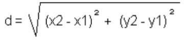

<p align="center">
  
</p>

# Algoritmos - Lista de exercícios 01 - TIII - Sequenciais

---

1) Faça um algoritmo que leia as 4 notas de um aluno e calcule a média aritmética simples deste aluno. 

​        media = (nota1+nota2+nota3+nota4)/4

2) Faça um programa que leia um número e mostre como resposta esse número elevado ao cubo.
   
   1) Faça um algoritmo que calcule a hipotenusa. Usar fórmula de Pitágoras.
      
      ```js
      h = sqrt(b**2+c**2)
      ```

3) Faça um programa de computador para calcular a área de um retângulo. Area = base * altura 
   a=b*h

4) Faça um programa que calcule quantas peças de piso são necessárias para um determinado ambiente. Deve-se informar as dimensões do ambiente em metros e o tamanho dos pisos em centímetros. Considere que é necessário um acréscimo de 10% na quantidade de pisos para que haja sobra para recortes.

5) Faça um programa que calcule o preço de um produto à vista e a prazo. Informa-se o preço do produto e o programa calcula e mostra o preço do produto com desconto de 10% e o preço do produto com acréscimo de 5%.

6) A fábrica de refrigerantes Meia-Cola vende seu produto em três formatos: lata de 350 ml, garrafa de 600 ml e garrafa de 2 litros. Se um comerciante compra uma determinada quantidade de cada formato, faça um algoritmo para calcular quantos litros de refrigerante ele comprou.

7) Construa um algoritmo que, tendo como dados de entrada dois pontos quaisquer no plano, P(x1,y1) e P(x2,y2), escreva a distância entre eles. A fórmula que efetua tal cálculo é:

<p align="center">
  
</p>

9) Pedrinho tem um cofrinho com muitas moedas, e deseja saber quantos reais conseguiu poupar. Faça um algoritmo para ler a quantidade de cada tipo de moeda, e imprimir o valor total economizado, em reais. Considere que existam moedas de 1, 5, 10, 25 e 50 centavos, e ainda moedas de 1 real. Não havendo moeda de um tipo, a quantidade respectiva é zero.

10) Um funcionário recebe um salário fixo mais 4% de comissão sobre as vendas. Faça um algoritmo que receba o salário fixo de um funcionário e o valor de suas vendas, calcule e mostre a comissão e o salário final do funcionário.