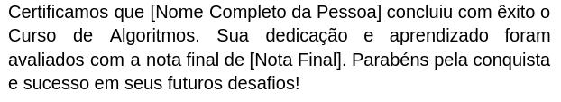

  

#  LA03 - Lista de Exercícios 03 - Sequenciais

1) Escreva um algoritmo que troque os valores de duas variáveis. Por exemplo, se a = 5 e b = 3, após a execução do algoritmo, a deverá conter o valor 3 e b deverá conter o valor 5.

2) Crie um algoritmo que calcule a gorjeta de um restaurante. O usuário deve inserir o valor total da conta e o algoritmo deve calcular e exibir 10% desse valor como gorjeta.

3) Escreva um algoritmo que converta uma temperatura de graus Celsius para Fahrenheit. O usuário deve inserir a temperatura em Celsius e o algoritmo deve exibir o valor equivalente em Fahrenheit.

4) Crie um algoritmo que converta um valor de uma moeda para outra. O usuário deve inserir o valor em uma moeda (por exemplo, em reais) e o algoritmo deve converter para outra moeda (por exemplo, dólares), utilizando uma taxa de conversão fixa.

5) Faça um algoritmo que calcule a área de um retângulo. O usuário deve inserir o comprimento e a largura do retângulo, e o algoritmo deve calcular e exibir a área.

6) Crie um algoritmo que calcule a idade de uma pessoa em dias. O usuário deve inserir sua idade em anos, 
meses e dias e o algoritmo deve calcular e exibir a idade em dias. Considere que os meses têm 30 dias.

7) Considere como entrada de dados o nome completo de uma pessoa e sua nota final. Faça um programa que imprima o texto do certificado.

  

8) Escreva um algoritmo que receba três valores distintos e armazene-os em três variáveis (por exemplo, a, b, e c). O algoritmo deve então realizar uma troca de valores de forma que, ao final da execução, a variável a contenha o valor originalmente armazenado em b, a variável b contenha o valor originalmente armazenado em c, e a variável c contenha o valor originalmente armazenado em a.

9) Faça um programa em JS que posicione um botão na tela e um parágrafo identificado como contador. Cada vez que o usuario clicar o botão o contador será incrementado em 1.

10) Faça um programa em JS que posicione um botão na tela e um parágrafo identificado como acumulador. Deve ter também um input para que o usuário digite números. Cada vez que o usuario clicar o botão o acumulador irá somar ao acumulador o valor que estiver no input. Considere que o valor inicial é zero.