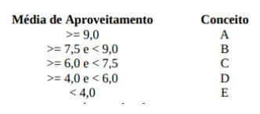
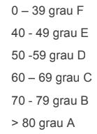

## Algoritmos - Lista de exercícios 05 - Condicionais

1) Escreva um algoritmo que leia 3 números inteiros e mostre o menor deles.

2) Escrever um algoritmo que lê um conjunto de 4 valores i, a, b, c, onde i é um valor inteiro e positivo e  a, b, c, são quaisquer valores reais. A seguir:
- Se i=1 escrever os três valores a, b, c em ordem crescente.
- Se i=2 escrever os três valores a, b, c em ordem decrescente.
- Se i=3 escrever os três valores a, b, c de forma que o maior entre a, b,c fique dentre os dois.

3) Ler o nome de dois times e o número de gols marcados na partida. Escrever o nome do vencedor. Caso não haja vencedor deverá ser impressa a palavra EMPATE.

4) Escreva um algoritmo que leia as idades de 2 homens e 2 mulheres (considere que as idades dos homens serão sempre diferentes, bem como as das mulheres). Calcule e escreva a soma das idades do homem mais velho com a mulher mais nova, e o produto das idades do homem mais novo com a mulher mais velha.

5) Escrever um algoritmo que lê o número de identificação, as 4 notas obtidas por um aluno nas 4 verificações e a média dos exercícios que fazem parte da avaliação. Calcular a média de aproveitamento, usando a fórmula: MA = (Nota1 + Nota2 x 2 + Nota3 x 3 + Nota4 x 4+ ME )/11. A atribuição de conceitos obedece a tabela abaixo:

  

* O algoritmo deve escrever o número do aluno, suas notas, a média dos exercícios, a média de aproveitamento, conceito correspondente e a mensagem: APROVADO se o conceito for A,B ou C e REPROVADO se o
conceito for D ou E.

6) São dados graus para as notas de um exame como se segue:

  

Codifique o algoritmo para que imprima o grau de qualquer nota dada, para os alunos que fizeram o exame.

7) Ler 3 valores (considere que não serão informados valores iguais) e escrever a soma dos 2 maiores.

8) Elaborar um algoritmo que lê 3 valores a, b, c e verifica se eles formam ou não um triângulo. Supor que os valores lidos são inteiros e positivos. Caso os valores formem um triângulo, calcular e escrever a área deste triângulo. Se não formam triângulo escrever os valores lidos. (lembre-se que a soma de
dois lados não pode ser menor que o terceiro).

9) Problemas simples do cotidiano podem representar desafios para o mundo computacional. Faça um algoritmo que, dados três números inteiros representando dia, mês e ano de uma data, imprima qual o dia seguinte.

10) Faça um algoritmo que, dado o valor total em reais e o número de prestações desejadas, calcule o valor de cada prestação. O número mínimo de prestações deve ser 12. Se o número de prestações for maior ou igual a 24, adicione 10% de juros ao valor total, se for maior ou igual a 36, adicione 15% de juros ao valor total.