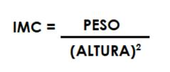
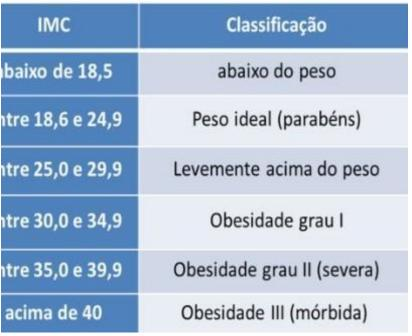
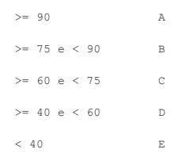

  

# AL06 - Lista de algoritmos 06 - Condicionais

1) O IMC (Índice de Massa Corporal) é um critério da Organização Mundial de Saúde para dar uma indicação sobre a condição de peso de uma pessoa adulta. A fórmula é:

  

- Com o valor do IMC calculado o programa deve informar a condição . Conforme a tabela abaixo

  

2) Elabore um algoritmo (e programa em JS) que calcule o que deve ser pago por um
   produto, considerando o preço normal de etiqueta e a escolha da condição de pagamento.
   Utilize os códigos da tabela a seguir para ler qual a condição de pagamento escolhida e
   efetuar o cálculo adequado.
   Código - Condição de pagamento

1 - À vista em dinheiro ou cheque, recebe 15% de desconto

2 - À vista no cartão de crédito, recebe 10% de desconto

3 - Em duas vezes, preço normal de etiqueta sem juros

4 - Em 3 vezes, preço normal de etiqueta mais juros de 5%

3) Escreva um algoritmo que leia o RA, as 3 notas obtidas por um aluno nas 3 verificações e
   a média dos exercícios que fazem parte da avaliação, e calcule a média de aproveitamento,
   usando a fórmula:
   
   

MA = (nota1 + nota 2 * 2 + nota 3 * 3 + ME)/7

A atribuição dos conceitos obedece a tabela abaixo. O algoritmo deve escrever o RA do
aluno, suas notas, a média dos exercícios, a média de aproveitamento, o conceito
correspondente e a mensagem 'Aprovado' se o conceito for A, B ou C, e 'Reprovado' se o
conceito for D ou E.
Média de aproveitamento Conceito

  

4) ) Faça um algoritmo que leia o nome, o sexo e o estado civil de uma pessoa. Caso sexo seja “F” e estado civil seja “CASADA”, solicitar o tempo de casada (anos). (Este exercício vai misturar coisas da entrada de dados com o processamento. Preste atenção nisso, pois algumas vezes temos que adaptar a solução ao problema).

5) Você viajou para os Estados Unidos e descobriu que lá a unidade de medida de temperatura é diferente da do Brasil. Para não ter que acessar um serviço na internet a todo o momento, nem fazer os cálculos manualmente, faça um algoritmo, e programa em JS, que converte a temperatura informada para a temperatura na outra unidade de medida. Ou seja, se a temperatura for informada em Celsius o algoritmo deve fornecer a temperatura em Fahrenheit, já se a temperatura for fornecida em Fahrenheit, o resultado deve ser em
   graus Celsius. As fórmulas de conversão devem ser pesquisadas na internet.

6) De acordo com o calendário Gregoriano (implantado em 1582), um ano é bissexto se ele é múltiplo de 400 ou é múltiplo de 4 mas não de 100. Desenvolva um programa que receba um ano e imprima SIM se ele for bissexto e NAO caso contrário. Na entrada o ano deve ser maior que>1582. Mais detalhes aqui:
   https://escolakids.uol.com.br/matematica/calculo-do-ano-bissexto.htm