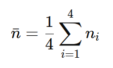
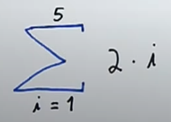
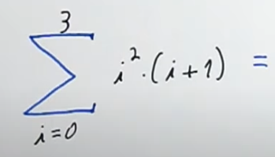
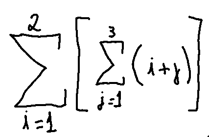
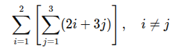

## Algumas vezes ficamos confusos com expressões da matemática. Até coisas que sabemos fazer desde o segundo ano primário parecem difíceis.

  
 [Σ SOMATÓRIOS e suas Propriedades](https://www.youtube.com/watch?v=zygBC5kY6es)

E o problema não é de matemática e sim de linguagem. Não entendemos o que está sendo falado.

1) Faça um programa de computador, usando HTML e JS para resolver a expressão:

A expressão deverá ser resolvida em uma function. Ou seja, deve criar uma function para fazer esse processamento (além da function acionada no button). O usuário fornecerá os valores de n.

--- 

2) Faça um programa de computador, usando HTML e JS para resolver a expressão e a expressão deverá ser resolvida em uma function:
   
 

3) Faça um programa de computador, usando HTML e JS para resolver a expressão e a expressão deverá ser resolvida em uma function:
   

4) Faça um programa de computador, usando HTML e JS para resolver a expressão. É obrigatório usar uma function para o processamento da expressão.

5) Faça um programa de computador, usando HTML e JS para resolver a expressão. É obrigatório usar uma function para o processamento da expressão.

1) 