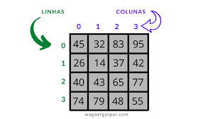

# 04/08/2025 - Retorno após férias de julho

Recapitulação
- algoritmos
  - sequência de passos finitos para resolver um problema (entrada, processamento e saída)

- algoritmos sequenciais (sem desvios)
- variáveis (numéricas e texto)
- condicionais (com desvios condicionais - if)
- funções
- laços de repetição
- variáveis indexadas (arrays - vetores) e manipulação de strings (vetor de caracteres) - conjuntos

# Conteúdo do 3º bimestre

### agregados homogêneos multidimensionais (matrizes)

 
Leia uma matriz de ordem 3x4 (3 linhas e 4 colunas).Faça uma
        função (para cada item) que calcule e mostre. 
        a) soma dos elementos de cada coluna. 
        b) média de cada linha. 
        c) a soma de todos os elementos da matriz. 

### agregados heterogêneos (uni e multidimensionais)

data da avaliação bimestral (19/09/2025)

### 04/08/2025		2	seg
Conceitos e aplicações de matrizes

### 08/08/2025		3	sex
Aula teórica (g102) exercícios com matrizes. Entrada de dados.

### 11/08/2025		2	seg
Exercícios
Matrizes, funções e organização de código.

1) Leia uma matriz de ordem NxM de numeros inteiros e armazene na memória RAM do computador. Em seguida faça uma função para cada item abaixo:
a) somar todos os elementos da matriz
b) somar uma coluna, cujo número será informado pelo usuário.
c) calcular a média aritmética simples de uma linha informada pelo usuário.
d) separar em um vetor todos os números pares que estiverem na matriz
e) conte quantos números primos estão na matriz
f) mostre a posição (linha e coluna) do maior elemento da matriz
g) multiplique dois números da matriz, cujas posições serão informadas pelo usuário.

15/08/2025		3	sex
18/08/2025		2	seg (gincana)
22/08/2025		3	sex
25/08/2025		2	seg
29/08/2025		3	sex
01/09/2025		2	seg
05/09/2025		3	sex
08/09/2025		2	seg
 
 - repescagem (nesta semana - todo o conteúdo do primeiro semestre)
  
12/09/2025		3	sex
15/09/2025		2	seg
19/09/2025		3	sex - avaliação 3º Bimestre
22/09/2025		2	seg
26/09/2025		3	sex
29/09/2025		2	seg
03/10/2025		3	sex -	Recuperação paralela 3º bimestre
06/10/2025		2	seg

--- 

10/10/2025		3	sex -  inicio do 4º bimestre
17/10/2025		3	sex - 
20/10/2025		2	seg
24/10/2025		3	sex
31/10/2025		3	sex
03/11/2025		2	seg
07/11/2025		3	sex
10/11/2025		2	seg
14/11/2025		3	sex
17/11/2025		2	seg
24/11/2025		2	seg
28/11/2025		3	sex
01/12/2025		2	seg
05/12/2025		3	sex - Avaliação 4º Bimestre
08/12/2025		2	seg
12/12/2025		3	sex - Recuperação paralela 4º bimestre
15/12/2025		2	seg
19/12/2025		3	sex

