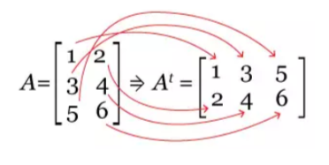
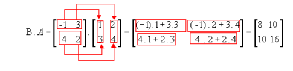

AL11 \- Algoritmos \- Lista de Exercícios 11 \- TIII \- Matrizes

Deve-se utilizar funções, sempre que possível/necessário.

1\) Adicionar elementos em uma matriz e depois listar essa matriz.  
2\) Leia uma matriz de ordem 3x4 (3 linhas e 4 colunas).Faça uma função (para cada item) que calcule e mostre.   
a) soma dos elementos de cada coluna.   
b) média de cada linha.  
c) a soma de todos os elementos da matriz.

3\) Leia os dados para uma matriz quadrada de ordem 3\. Faça uma função que imprima os elementos da diagonal principal.

4\) Leia os dados para uma matriz quadrada de ordem 4\. Faça uma função que calcule a  média dos elementos da diagonal secundária.

5\) Escreva um algoritmo que leia uma matriz 3x3 de números inteiros e uma função que calcule a soma de todos os seus elementos.

6\) Implemente um algoritmo que leia uma matriz 4x4 de números inteiros e uma função que gere a matriz transposta.

[Solução em vídeo](https://www.youtube.com/watch?v=OlyGZ94omwM)

7\) Crie um algoritmo que leia duas matrizes 2x2 e calcule o produto dessas matrizes.

8\) Escreva um algoritmo que leia uma matriz de números inteiros e um número inteiro X. Faça uma função que mostre a posição do número na matriz,  se ele estiver presente na matriz.  
9\) Desenvolva um algoritmo que leia uma matriz de números inteiros. Faça uma função que encontre o maior, outra que encontre   o menor elementos da matriz, juntamente com suas respectivas posições.  
10\) Implemente um algoritmo que gere uma matriz de números inteiros aleatórios. Faça funções que calculam as somas dos elementos da diagonal principal e da diagonal secundária.  
11\) Escreva um algoritmo que leia uma matriz 3x3 de números inteiros e calcule uma função que calcule a média dos seus elementos.  
12\) Crie uma função que gere uma matriz identidade de ordem N (N deve ser fornecido pelo usuário). O exemplo abaixo mostra as matrizes identidade de ordem 2, 3, 4 e 5\.  

13\) Desenvolva uma função que receba uma matriz qualquer de números inteiros e substitua todos os elementos negativos por zero. Mostre a matriz resultante.

14\) Escreva uma função que receba uma matriz 3x3 de números inteiros e gere uma nova matriz que seja a imagem espelhada horizontalmente da matriz original. Mostre o resultado em formato de matriz.

 espelhada ===> 

15\) Crie um algoritmo que leia uma matriz 4x4 de números inteiros e verifique se a matriz é simétrica.Uma matriz simétrica é uma matriz quadrada que é igual à sua transposta. Use funções.

16\) Escreva um programa que, a partir de um nome informado pelo usuário, exiba suas  iniciais.  As iniciais são formadas pela primeira letra de cada nome. Note que os conectores e, do, da, dos, das e  de, não são considerados nomes e, portanto, não devem ser considerados para a  obtenção das iniciais. As iniciais devem ser impressas em maiúsculas, ainda que o nome  seja digitado todo em minúsculas.  Exemplos:  Maria das Graças Pimenta \=\> MGP  João Carlos dos Santos \=\> JCS  José da Silva \=\> JS  Pedro Pereira Teixeira \=\> PPT.

17\) Homer Simpson, Barney Gumble e Carl Carlson estão mais uma vez desfrutando de sua paixão por rosquinhas. Desta vez, eles estão competindo para ver quem come mais rosquinhas em uma semana.

Faça um algoritmo que use uma matriz, onde cada  elemento contém o número de rosquinhas que cada um deles comeu em um dia específico da semana, escreva um algoritmo para determinar quem comeu mais rosquinhas ao longo da semana. Se houver um empate, retorne todos os que comeram mais rosquinhas.

Exemplos de listas

\[\[10, 5, 8, 12, 7\],   // Homer  
 \[8, 6, 10, 9, 11\],   // Barney  
 \[12, 7, 9, 8, 10\]\]   // Carl

Avançados

18\) Faça um programa que popule uma matriz com um triângulo de Pascal.   
 
a parte acima da diagonal principal deverá ser preenchida com zeros

19\) Faça um programa para gerar um quadrado mágico em uma matriz quadrada de ordem ímpar. O número 1 vai na última coluna na linha do meio. Depois aplica a regra uma linha para baixo, uma coluna para direita e se a célula estiver vazia, coloca o próximo número. Caso haja uma coincidência, considerando o local da coincidência contar duas linhas para baixo e uma coluna para direita. Quando “sai” da matriz vai para o outro lado (por exemplo, o número 2 iria na coluna 4, como ela não existe,volta para a coluna 1).

Se somar os valores de qualquer linha, coluna ou diagonal o resultado é sempre 15 (para ordem 3\)
