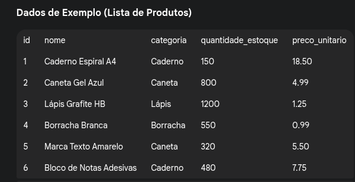

## Para cada descrição, faça um crud completo. Use o modelo https://github.com/rjhalmeman/algoritmos/tree/main/4bimestre/2025-09-29-CrudBase

1) Fruta

- int;id
- string;nome
- string;cor

--- 
2) Chocolate

- int;codigo
- string;nome
- string;fabricante
- date;dataDeLancamento
--- 
3) Celular

- int;numeroMac
- string;modelo
- string;fabricante
- float;preco

--- 
4) Bebida

- int;id
- string;nome
- string;fabricante
- double;precoEtiqueta
- boolean;ehAlcolico

--- 
5) Notebook

- string; id
- string; modelo
- date; dataLancamento
- string; fabricante
- int;quantidadeDeRAM (em GB)
- string;processador
- string;fabricanteDoProcessador
- int;armazenamentoPermanente (em GB)

Adicione um botão extra e um input, onde será lida uma quantidade de RAM e liste apenas os computadores que possuirem aquela quantidade ou mais de RAM.

--- 
6) Boletim

- string;materia
- float;nota1
- float;nota2
- float;nota3
- float;nota4

Após fazer o CRUD, adicione um botão que calcule e mostre a média para cada disciplina (pode modificar o listar)

---

** adicionados 20/10/2025

---
7) Filme

- int;id  
- string;titulo  
- string;diretor  
- date;dataLancamento  
- float;avaliacao  

🔹 Adicione um botão que filtre e mostre apenas os filmes com **avaliação acima de 8.0**.

Vídeo mostrando como foi resolvido

https://youtu.be/yrdV3kfNPsU

---

8) Animal

- int;id  
- string;especie  
- string;nome  
- int;idade  
- float;peso  

🔹 Adicione um botão que mostre o **animal mais pesado** cadastrado.

---

9) Livro

- int;codigo  
- string;titulo  
- string;autor  
- int;anoPublicacao  
- string;genero  

🔹 Adicione um campo de busca que mostre **apenas os livros de um determinado gênero**.

🔹 Adicione um campo de busca que mostre **apenas os livros de um determinado autor**.

🔹 Adicione um campo de busca que mostre **apenas os livros de um determinado ano de publicação**.

---

10) Aluno

- int;ra  
- string;nome  
- float;nota1  
- float;nota2  
- float;nota3  
- float;nota4  

🔹 Adicione um botão que calcule a **média de cada aluno** e mostre se o aluno **passou (≥6)** ou **reprovou**.

🔹 Adicione um botão que calcule a **maior nota de cada aluno**.

🔹 Adicione um botão que calcule a **média da turma**.

🔹 Adicione um botão que calcule a **porcentagem de alunos reprovados**.

---

11) Jogo

- int;codigo  
- string;titulo  
- string;plataforma  
- string;genero  
- float;preco  

🔹 Adicione um filtro para mostrar apenas **jogos de uma plataforma específica**.

🔹 Adicione um filtro para mostrar apenas **jogos em uma faixa de preço**.

---

12) Restaurante

- int;id  
- string;nome  
- string;cozinha  (comida chinesa, por exemplo)
- float;nota  
- boolean;fazEntrega  

🔹 Adicione um botão que **liste apenas os restaurantes que fazem entrega e têm nota ≥ 4**.

🔹 Adicione um botão que **liste os restaurante em ordem do melhor avaliado para o pior avaliado.**.

---

13) Serie

- int;id  
- string;titulo  
- int;temporadas  
- string;plataforma  
- float;avaliacao  

🔹 Adicione um botão que mostre **a série com o maior número de temporadas**.

🔹 Adicione um botão que mostre **a série com o menor número de temporadas**.

🔹 Adicione um botão que mostre **a série de uma plataforma específica melhor avaliada**.

---

14) Considere a lista de produtos

Faça um CRUD completo para gerenciar a lista, usando menu suspenso, data list e/ou data list (o que achar mais adequado).

Adicione a possibilidade de escolher uma categoria e seu programa vai mostrar todos os elementos daquela categoria. Deve-se usar um menu suspenso na escolha da categoria.

--- 

# 15) Faça um CRUD completo para 
    
## Imovel

int;numMatricula

String;endereco

String;bairro

String;tipo

float;area

int;comodos

boolean;alugado

Date;dataDeConclusaoDaConstrucao

### Após fazer o CRUD básico funcionar, acrescente as funcionalidades abaixo.

O número da matrícula não pode ser zero ou negativo.

Para o atributo bairro, use um menu suspenso para que o usuário possa escolhem entre 5 bairros.

Os tipos são residencial, comercial ou rural. Use um menu suspenso.

A quantidade de cômodos não pode ser menor do que 1. 

O atributo alugado deve ter um checkbox.  

--- 

# 16) Faça um CRUD completo para:

## Aluguel

int;numeroContrato

String;nomeProprietario

String;nomeInquilino

float;valorAluguel

int;prazoDoContratoEmMeses

boolean;estaAlugado

Date;dataDeInicioDoContrato

String;cepImovel

String;enderecoImovel

String;bairro

String;cidade

### Restrições

O número do contrato deve ser maior que zero.

O nome do proprietário não pode ficar vazio.

O nome do inquilino não pode ficar vazio.

O valor do aluguel deve ser maior que zero.

O prazo de contrato deve ser um número entre 1 e 48.

Deve-se usar checkbox para o atributo estaAlugado.

Ao informar a dataDeInicioDoContrato, deve-se calcular e mostrar a data de término (conforme o prazo do contrato).

Extra:
Ao digitar o cep é possível usar uma API para preencher os demais atributos. Consulte https://viacep.com.br/. 

--- 

## 17) CRUD: Controle de Equipamentos

### Tabela `Equipamento`

| Tipo | Atributo | 
|------|-----------|
| `int` | **patrimonio** |
| `string` | **descricao**| 
| `date` | **dataDeAquisicao** |
| `string` | **localizacao** |
| `boolean` | **emManutencao** |

---

### Restrições
- `patrimonio`: 6 dígitos obrigatórios  
- `dataDeAquisicao`: não pode ser futura  
- `localizacao`: usar `<datalist>` com opções predefinidas -sugestões: “E001”, “E007”, “F001”
- `emManutencao`: usar `<input type="checkbox">`

### Funcionalidades

- Possibilite escolher uma localização e liste todos os equipamentos desta localização.
- Liste todos os equipamentos que estão em manutenção

---
