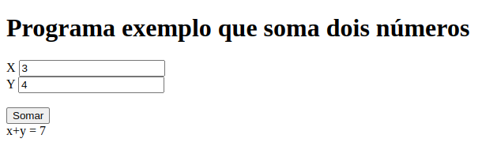

# Algoritmos

## 📌 Definição Formal de Algoritmo
Um algoritmo é um conjunto finito de instruções bem definidas, ordenadas e não ambíguas que, quando seguidas, resolvem um problema ou realizam uma tarefa específica, em um tempo finito.


# 📘 Fundamentos de Algoritmos com JavaScript e HTML

Os algoritmos possuem:
    - entrada de dados
    - processamento
    - saída


## 1. Sequenciais
São instruções executadas na ordem em que aparecem no código. É a base de todo algoritmo.


**Programa exemplo que solicita dois números, efetua a soma e mostra o resultado**



```html
<!DOCTYPE html>
<html lang="en">

<head>
    <meta charset="UTF-8">
    <meta name="viewport" content="width=device-width, initial-scale=1.0">
    <title>Programa soma</title>
</head>

<body>
    <h1>Programa exemplo que soma dois números</h1>
    <!-- Programa em HTML e JavaScript para somar 2 números -->
    <label for="inputN1">X</label>
    <input type="number" name="inputN1" id="inputN1">
    <br>
    <label for="inputN2">Y</label>
    <input type="number" name="inputN2" id="inputN2">
    <br>
    <br>
    <input type="button" value="Somar" onclick="funcaoResponsavelPeloCalculo()">
    <br>
    <label for="resposta">x+y = </label>
    <span id="resposta">innerHTML</span>

    <script>
        function funcaoResponsavelPeloCalculo() {
            let x = parseFloat(document.getElementById("inputN1").value);
            let y = parseFloat(document.getElementById("inputN2").value);
            let s = x + y;
            document.getElementById("resposta").innerHTML = s;
        }
    </script>

</body>

</html>
```

---

## 2. Variáveis e Tipos de Variáveis
 
Variáveis são espaços (locais) na memória (normalmente memória RAM) que são usados para armazenar valores. Em JavaScript, elas podem conter diferentes tipos de dados como números, textos, booleanos, listas e objetos.

**Tipos comuns:**
- `string` → textos
- `number` → números
- `boolean` → verdadeiro ou falso
- `array` → listas
- `object` → estruturas com chave e valor

**Exemplo:**
```html
<script>
  let idade = 25;               // number
  let nome = "Ana";             // string
  const pi = 3.14;              // constante
  let ativo = true;             // boolean
  let lista = [10, 20, 30];     // array
  let pessoa = {nome: "Leo", idade: 30}; // objeto
</script>
```

---

## 3. Funções

São blocos de código que executam tarefas específicas. Podem receber parâmetros e retornar resultados.

**Exemplo:**
```html
<script>
  function somar(a,b) {
    return a+b;
  }
  let s = somar(3,5);
  console.log("resultado da soma = "+s);
</script>
```

---

## 4. Condicionais
**O que é:**  
Permitem tomar decisões, executando diferentes blocos de código com base em condições lógicas.

**Exemplo:**
```html
<script>
  let idade = 17;

  if (idade >= 18) {
    alert("Você é maior de idade.");
  } else {
    alert("Você é menor de idade.");
  }
</script>
```

---

## 5. Repetição
**O que é:**  
Permite executar um bloco de código várias vezes. Usamos `for`, `while`, entre outros.

**Exemplo:**
```html
<script>
  for (let i = 1; i <= 5; i++) {
    console.log("Contador: " + i);
  }
</script>
```

---

## 6. Conjuntos (Vetores e Matrizes)
**O que é:**  
São estruturas que armazenam vários valores. Vetores são listas simples; matrizes são tabelas com linhas e colunas.

**Exemplo - Vetor:**
```html
<script>
  let frutas = ["maçã", "banana", "laranja"];
  alert(frutas[1]); // banana
</script>
```

**Exemplo - Matriz:**
```html
<script>
  let matriz = [
    [1, 2, 3],
    [4, 5, 6]
  ];
  alert(matriz[1][0]); // 4
</script>
```
